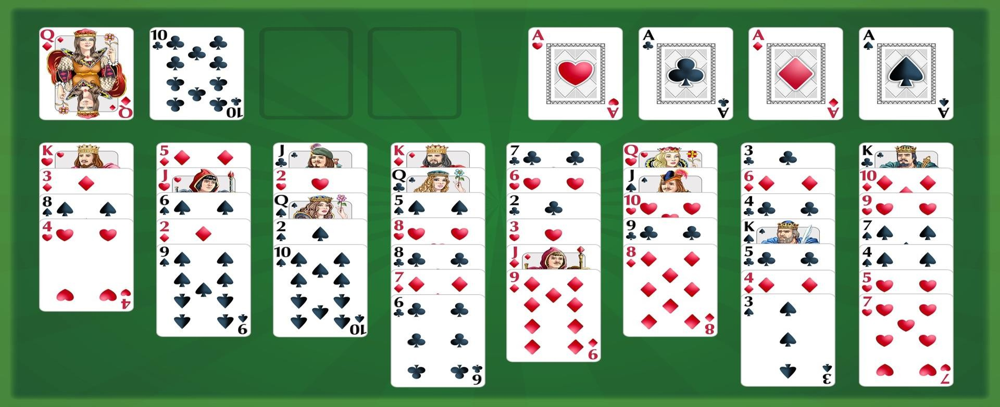

# 🃏 FreeCell Game Project - CLI Version in C

> Jeu de cartes FreeCell en ligne de commande, développé en langage C dans le cadre d'un projet académique.


---

## 🎮 À propos du projet

**FreeCell-CLI** est une implémentation en ligne de commande du célèbre jeu de cartes *FreeCell*, populaire dans les versions de Windows.  
Ce projet a été réalisé en C sans interface graphique, uniquement à l'aide d'entrées et sorties texte dans le terminal.

### ✨ Objectifs pédagogiques

- Approfondir la manipulation des pointeurs et des structures en C
- Mettre en œuvre une logique de jeu complexe (gestion des piles, mouvements autorisés, conditions de victoire)
- Apprendre à structurer un projet C modulaire
- Développer une interface utilisateur en ligne de commande

---

## 🧩 Fonctionnalités

- [x] Affichage du plateau de jeu
- [x] Saisie interactive des mouvements par l'utilisateur
- [x] Vérification des règles de FreeCell
- [x] Déplacement des cartes entre colonnes, cellules libres et fondations
- [x] Détection automatique de victoire ou blocage

---


## 🏗️ Structure du projet

```bash
FreeCell-Project/
├── code_source/
│   ├── main.c              
│   ├── implementation.c    
│   └── functions.h         
├── bin/ 
├── images/                  
├── .gitignore              
└── README.md               
```

## ▶️ Exécuter le Projet

### Cloner le répertoire 
```bash
git clone https://github.com/MzioudMohamed/FreeCell-Project.git
```

### Méthode 1 : Avec Code::Blocks (recommandé)
  
1. **Ouvrir** : `File` → `Open...` → `FreeCell.cbp`.  
2. **Compiler** : `Build` → `Build` (ou `F9`).  
3. **Exécuter** : `Build` → `Run` (ou `F10`).  

### **Méthode 2 : Terminal (GCC)**  
```bash
gcc code_source/main.c code_source/implementation.c -o bin/FreeCell && ./bin/FreeCell
```

## 📸 Exemple d'exécution


